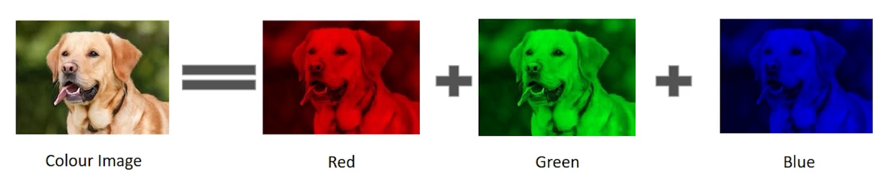
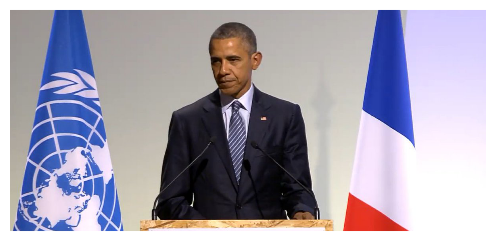
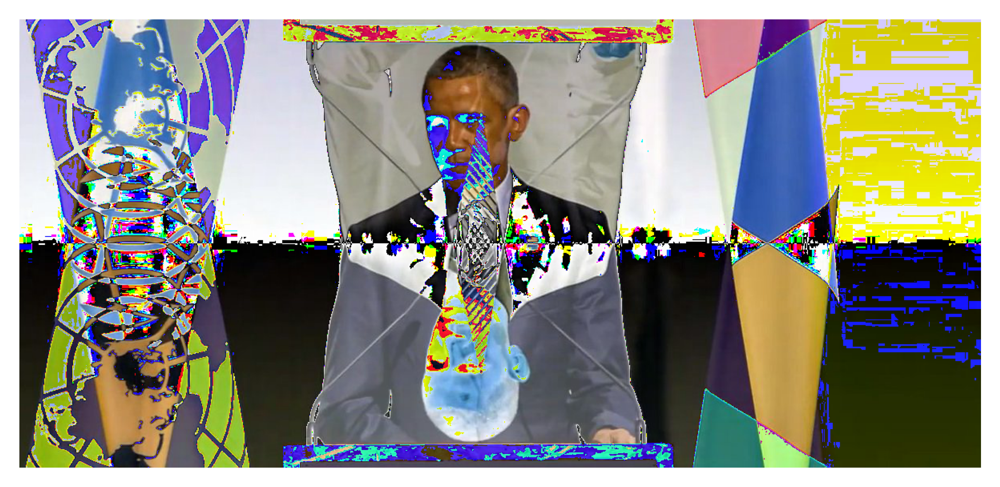
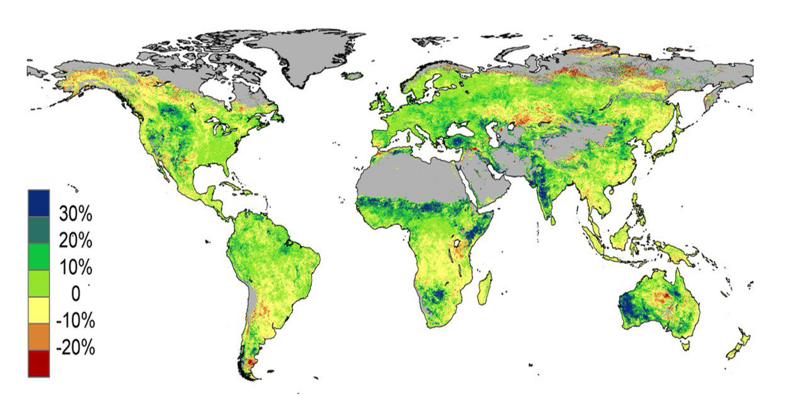
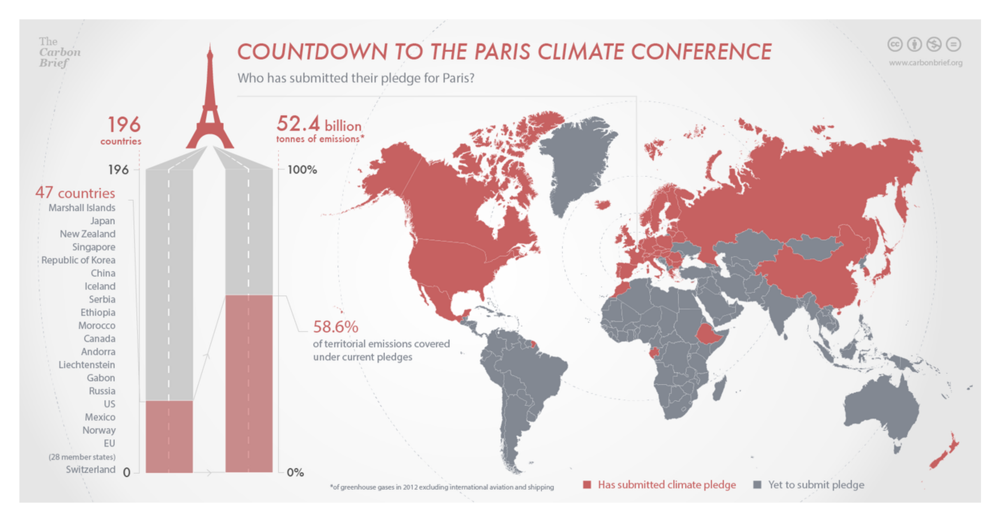
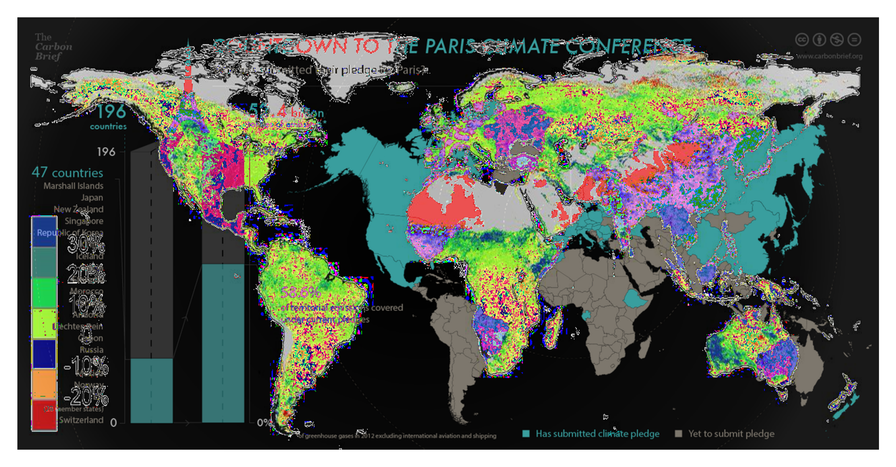

This section provides a by no means complete description of how the clustering
was performed for clusterings 1-5. Clustering 6 was performed by LR and exactly
how, is a mystery to me.

## Image Feature Extraction

Automated methods for clustering on the computer work with numbers that are
assumed to directly capture the *similarity* or *distance* in some relevant
way, between the objects being clustered. For example, say that we want to
group people based on their *age* into three distinct cluster. In this case, we
could record their age in years and perhaps we do so for eight persons and put
it in a list `age_list = [4, 90, 45, 76, 9, 43, 2, 87]`. A reasonable
clustering based on this list would be `cluster_1 = [2, 4]`, `cluster_2 = [45,
43]` and `cluster_3 = [76, 87, 90]`. Note that we could have represented age
differently using e.g. the date the person formatted as `1978 jan 21` but in
this case we would have to tell the computer how the distance between two dates,
formatted in this particular way, is calculated. Heuristically, clustering works
if the [absolute value](https://en.wikipedia.org/wiki/Absolute_value) you get when
*subtracting* one of the objects being clustered from the other is small if they are 
*similar* and large if they are *different*.

### Image Representation in Computers 

In computers images are represented as grids of
[pixels](https://en.wikipedia.org/wiki/Pixel), in which each cell of the grid
(also called matrix) corresponds to the amount of *brightness* of that
particular pixel. The number of pixels along the rows and columns of the grid
corresponds to the resolution and aspect ratio. For example your laptop might
be able to display 1920 (width) × 1080 (height) = 2,073,600 pixels.

If the image is gray-scale, then the convention is that the value 0 is completely black,
255 is completely white and everything in between are different shades of gray. For example
the number 8 can be represented in a 16 × 24 grid as seen in the image below [^1].

<figure markdown>

<figcaption>A grayscale image of the number 8</figcaption>
</figure>

For color images we follow the same principle but instead stack three grids for
the primary colors Red, Green. and Blue
([RGB](https://en.wikipedia.org/wiki/RGB_color_model)) as shown in the image
below [^1].

<figure markdown>

<figcaption>A color image of a dog</figcaption>
</figure>
[^1]: The images are taken from: <https://www.analyticsvidhya.com/blog/2021/03/grayscale-and-rgb-format-for-storing-images/>

Given that images are represented in this way as numbers, we might think that
we can cluster this representation directly. As we will see this is
unfortunately rarely a good idea if we want to compute some form of similarity
or distance between the images, since it assumes that individual pixel
locations in represent relevant and comparable aspects of the image. This makes
comparisons highly sensitive to things like *rotation*, *scale*, *resolution*,
*aspect ratio*, exact *position* and that the things we are interested in
always look the same across images. Let us look at two examples from the
`PolarVis` data. As humans we can clearly and immediately see that this picture
of Obama at COP21

<figure markdown>
{: style="height:83"}
<figcaption>Obama at COP21</figcaption>
</figure>

is the same as the one below. The only difference being that the second picture
has been flipped.

<figure markdown>
{: style="height:83"}
<figcaption>Flipped Obama at COP21</figcaption>
</figure>

Remembering our heuristic for when we are able to cluster, we can try
subtracting the second image of Obama from the first one. Provided that these
two are essentially the same image (in any relevant sense) we would hope the
resulting image to be completely black, since the pixel values should be 0. In
other words, we want the representation to be invariant to rotations of the
same image. As we see in the image below—this is certainly not the case.

<figure markdown>
{: style="height:83"}
<figcaption>Obama-flipped Obama at COP21</figcaption>
</figure>

We can look at a second example from the `PolarVis` data. This time we take two
completely different images but that are substantively similar. 

<figure markdown>
{: style="height:83"}
<figcaption>Map 1</figcaption>
</figure>

Both images show a map of the world and seem to highlight something about the
emissions of each country.

<figure markdown>
{: style="height:83"}
<figcaption>Map 2</figcaption>
</figure>

Subtracting one from the other again leads to nonsensical results and if taken
at face value—that the images are very different from one another when most
people would probably say that they are closely related.

<figure markdown>
{: style="height:83"}
<figcaption>Map 1 - Map 2</figcaption>
</figure>

One way to solve the issue presented here is to instead compare relevant
*features* of the images that are invariant to all of the challenges we saw in
the examples above. Many methods exist for the task of finding relevant
features, also called *[feature
extraction](https://en.wikipedia.org/wiki/Feature_extraction)*. In principle,
this is what we did when encoding *age* as a numeric value corresponding to the
number of years of the person, and it is not dissimilar to what we would do
when designing a coding scheme. To see that comparing the features of images at
least in principles makes it possible to cluster images we could define the
binary feature, `map` that takes the value 1 if the image has a map and 0
otherwise, and we can also define `emission` which again takes the value 1 if
the image is somehow related to global emissions and 0 otherwise. We can now
calculate the distance between the images and see that they are indeed very
similar according to our definition of relevant features.

$$
dist(img_1, img_2) = map_{img1} - map_{img2} + emission_{img1} - emission_{img2} = |1-1| + |1-1| = 0
$$

### Automatic Feature Extraction

In the previous example, we defined the relevant features as two binary
variables `map` and `emission` manually. Doing this for all relevant features,
in a large dataset is often times unfeasible and defeats the purpose of
automated clustering. For this reason, the features for clustering in this
workshop were extracted automatically. The dominant approach (also used here)
to this in modern image analysis is through *[Deep
Learning](https://en.wikipedia.org/wiki/Deep_learning)*. The key innovation is
that a deep learning model is able to *learn* which features are relevant not
by us imposing assumptions about what they should be, but rather through us
defining a task, by which the model must learn what features are important in
order to perform well. The task could for example be for  the model to predict
whether an image is about a protest or not. The reason why deep learning models
are sometimes referred to as black boxes is that these features are not always
directly interpretable or meaningful for us humans. As such, it can be
difficult understanding why a model has produced a particular
result—emphasising the need to rigorously validate any result in part
produced by a deep learning model. For a more comprehensive introduction to
deep learning for image analysis from a social science perspective you can read
the paper by Torres and Cantú [@torresLearningSeeConvolutional2022].

#### Transfer Learning

In this workshop we used a so called *pretrained* version of a model named CLIP
to extract a feature representation of the 150 COP21 images
[@radfordLearningTransferableVisual2021]. Transfer learning means that we can
reuse a model trained for a particular purpose on a new or similar task. This
is very practical since Deep learning is very expensive in the sense that it
generally needs a lot of data and compute power to perform well AKA learning
good and relevant features. This particular version has been pretrained on
dataset called [LAION-5B](https://laion.ai/blog/laion-5b/) which contains 5,85
billion image-text pairs

## K-Means Clustering
