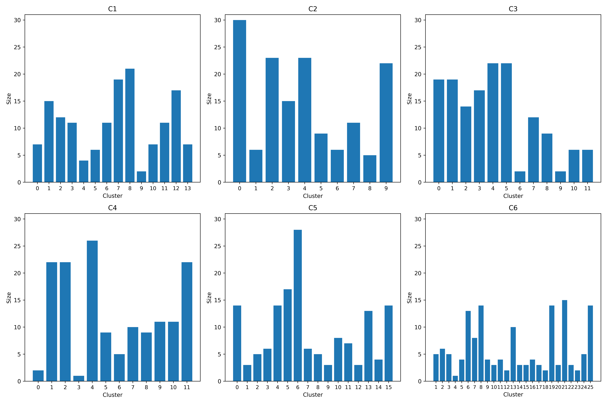
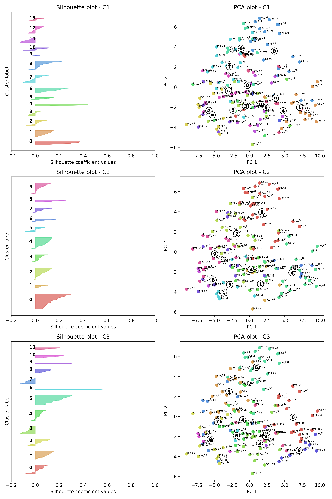
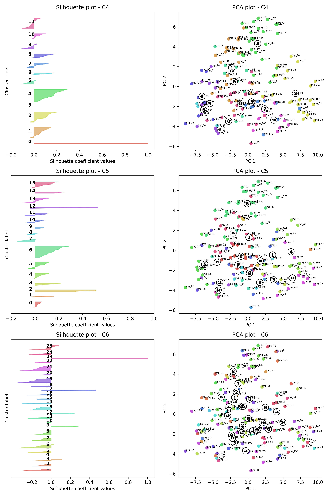
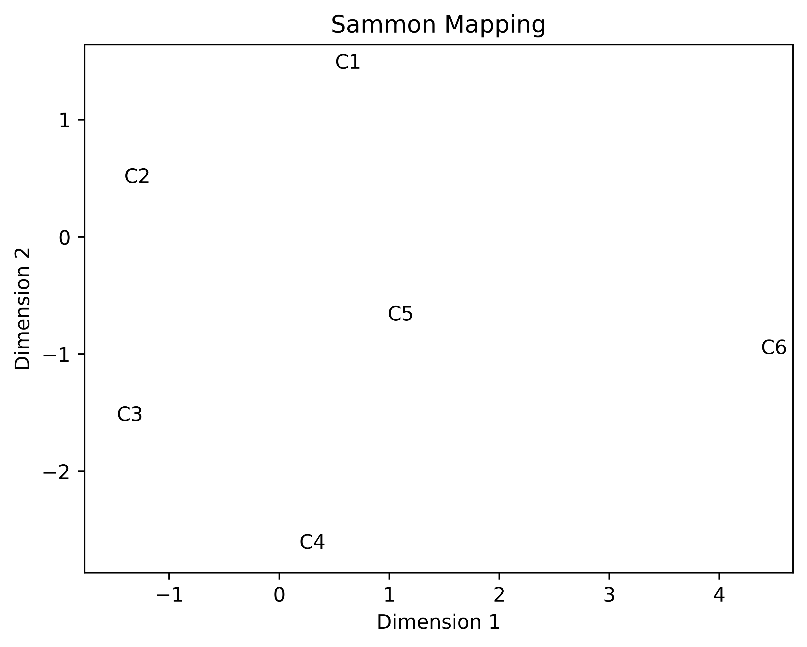

In this exercise, we clustered a limited number of images. This made it
perfectly feasible to visually inspect each image and cluster, but how should
we do when the size of dataset makes this impossible? This section suggests
three strategies for quantitatively evaluating the quality of a clustering, as
well as comparing several clusterings to each other. These methods can also be
informative in terms of understanding which images we should sample and focus
our attention to during validation. I want to stress that these are by no means
the only ways in which we can understand clustering results quantitatively and
that this kind of analysis is likely never going to replace the need of human
validation and qualitative interpretation.

## Understanding the *distribution* of clusters

As a first step, we may want look at the cluster distribution. This provides a
simple view of the number of images that have been assigned to each of the
clusters as shown in the figure below. The x-axis shows the cluster id and
y-axis the number of images assigned to the cluster. This can help us
understand if for example some clusters are very small or large and potentially
should be split or merged.

<figure markdown>

<caption "hej">
</figure>

## Analyzing the *distinctiveness* of clusters

A commonly used method for analyzing and interpreting how distinct the clusters
are, is visualizing a
[Silhouette](https://en.wikipedia.org/wiki/Silhouette_(clustering)) plot
[@rousseeuw1987silhouettes] as shown in the left panels in the figure below.
Here, each image is given a value ranging from -1 to 1 where a higher value
should be understood as the favorable assigned by which the image is similar to
its neighbors in the same cluster as well as distinct from other clusters. A
very low value instead indicates that the image lays in the middle of two or
more clusters. Based on this knowledge we might for example choose to inspect
images from neighboring clusters with low scores, as this could be indicative
if them being similar.

Silhouette plots should nonetheless be interpreted with caution. In particular,
it will tend to favor clustering methods that use the same distance metric as
the one used to calculate the Silhouette scores. This might lead one to
incorrectly consider one clustering method superior to the other. For example,
in this exercise clustering methods 1-5 use the same distance metric (Euclidean
distance) as was used to calculate the silhouettes, whereas clustering method 6
does not. Just looking at the Silhouette for clustering 6, it seems to perform
very badly, but this does not have mean that the clustering is bad. It still be
that the way the distance is measured in clustering 6 yields a better and more
insightful partition of the images.

## Comparing the *similarity* of different clusterings

A method for comparing different clusterings by visualizing their relative
similarity was proposed in [@grimmerGeneralPurposeComputerassisted2011]. It
consists of two main steps. First the distance between two clusterings is
computed using the *variation of information* (VI) metric
[@meilua2007comparing]. Intuitively, VI is a measure of the number of
*pair-wise* disagreements between two clusterings. A low score means that for
most pairs, the two clustering methods being compared agree on that the two
images should either be in same cluster or not. VI has some desirable
properties for such as the number of clusters may be different between the
clusterings being compared.

Once the similarity between each clustering has been calculated using VI,
[@grimmerGeneralPurposeComputerassisted2011] suggest using a dimensionality
reduction technique called [Sammon
mapping](https://en.wikipedia.org/wiki/Sammon_mapping) to visualize the
clusterings [@sammon1969nonlinear]. Dimensionality reduction means that we
attempt to reduce a high-dimensional space down to a lower dimensional space
that best describes the variation in the data. In this specific case, the
original space is equivalent to the number of clustering methods being compared
(6) which we reduce to two dimensions so that we can easily visualize the
results as shown in the figure below. It is rarely very informative to look at
the exact value of the x and y-axis, instead, we should probably focus on the
relative position of the clusterings. Just as with clustering there exists
a plethora of dimensionality reduction methods. In [@grimmerGeneralPurposeComputerassisted2011],
argue that Sammon mapping is suitable for this purpose since it is good at
preserving small distances between the clusterings, i.e. showing us which
methods yield similar results. However, this also implies that we should be
careful about interpreting distant clusterings as necessarily very different.

