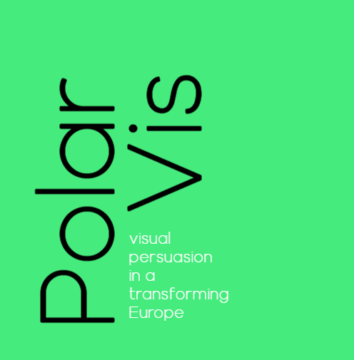

  

  

# Group Exercise: Computer-Assisted Image Clustering

By: *Matias Piqueras, Alexandra Segerberg, Matteo Magnani* and *Victoria Yantseva*

  
<!-- |Topic|Time|Content| -->
<!-- |-----|-----|-------| -->
<!-- |Intro to UPPMAX|13.15-14:00|Uppmax, NAISS, login, navigation, modules, SLURM| -->
<!-- |Python|14.15-15:00|Packages, Virutal environments, GPU code| -->
<!-- |Dev tools|15:15-16:00|Jupyter notebooks, VSCode| -->
<!-- |UPPMAX Tour|16:00-16:15|Visit of the serverhall with Jerker -->

[Get started!](instructions/instructions/){ .md-button .md-button--primary }

  

